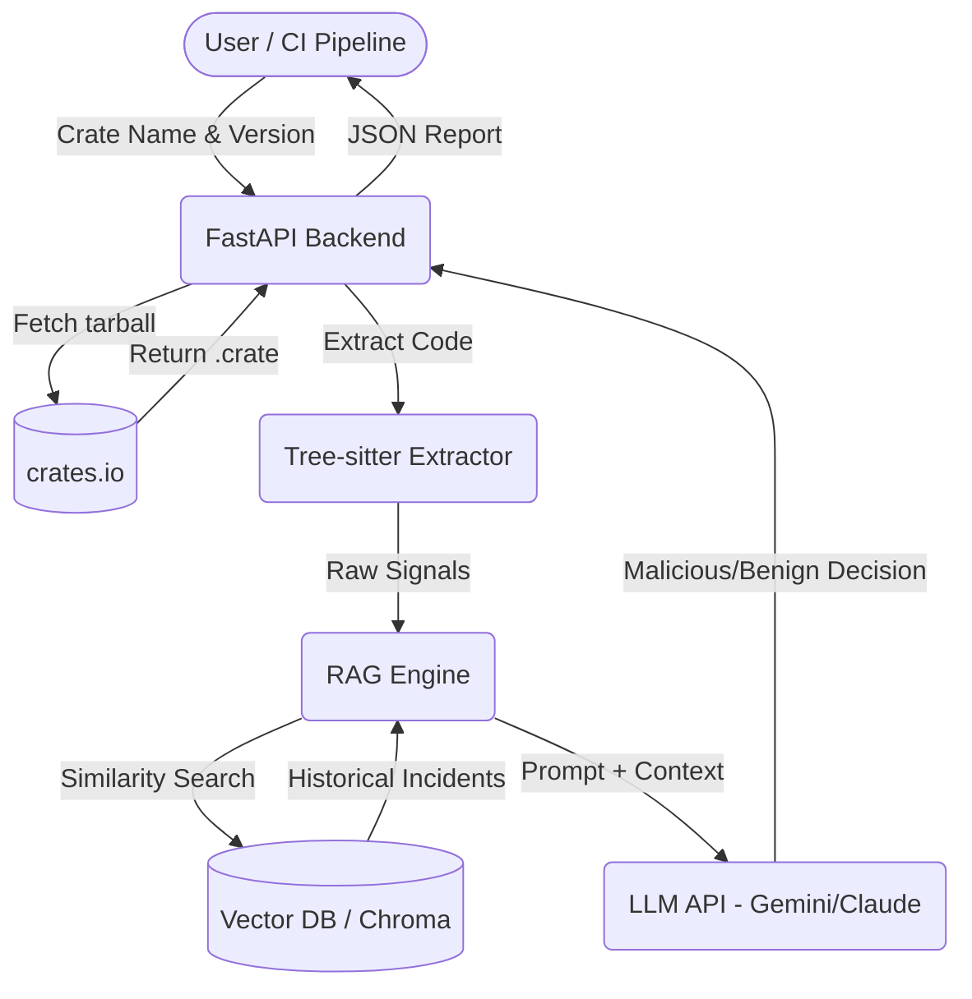
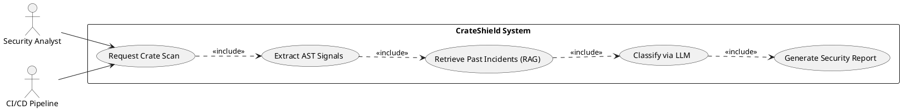

# Architecture Diagrams

## 1. Data Flow Diagram (DFD - Level 1)

## 2. Use Case Diagram (PlantUML)
*Note: You can render this directly in Jira using the PlantUML plugin or import it into draw.io.*

