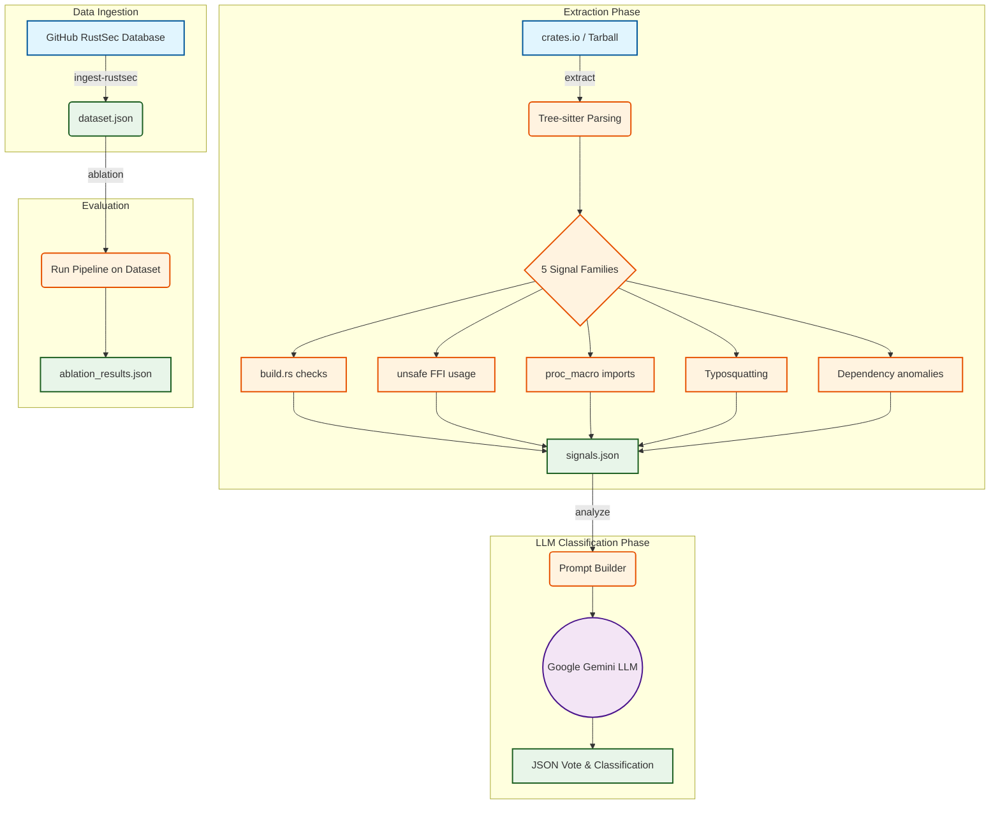

# CrateShield Pipeline Workflow

This document outlines the end-to-end data flow and execution pipeline for the **CrateShield** project.

## 1. Dataset Generation (`ingest-rustsec`)
* **What it does:** Fetches known malicious and backdoor crates from the official RustSec advisory database on GitHub.
* **Input:** GitHub API (RustSec Markdown/TOML advisories).
* **Output Type:** `JSON` (`dataset.json`)
* **Output Content:** A structured list of crates with their `name`, `version`, and `label` (e.g., `MALICIOUS`).

## 2. Signal Extraction (`extract`)
* **What it does:** Downloads the `.crate` tarball for a specific package and parses the Rust source code using `tree-sitter`. It statically extracts five families of "signals" (indicators of potential malice).
* **Input:** Crate name and version.
* **Output Type:** `JSON` (`data/signals/<crate>-<version>.json`)
* **Output Content:** Raw extracted data including network calls, spawned processes, environment variable reads in `build.rs`, unsafe code density, and typosquatting scores.

## 3. LLM Analysis (`analyze`)
* **What it does:** Runs the extraction phase, formats the raw signals into a text prompt, and sends it to the Gemini LLM. It asks the LLM 3 times (voting) to classify the crate as `MALICIOUS`, `SUSPICIOUS`, or `BENIGN`.
* **Input:** Crate name and version.
* **Output Type:** `JSON` (Printed to terminal)
* **Output Content:** The raw signals + the final LLM classification, confidence level, reasoning paragraph, and recommended action.

## 4. Evaluation / Ablation (`ablation`)
* **What it does:** Runs the entire pipeline over the labeled `dataset.json`. This is used to test the accuracy of the tool (comparing structured signals + LLM vs. raw code + LLM vs. cargo-audit).
* **Input:** `dataset.json`
* **Output Type:** `JSON` (`data/results/ablation.json`)
* **Output Content:** Aggregate statistics, accuracy scores, false positive rates, and detailed logs of which crates were classified correctly or incorrectly.

## 5. Model Training (`train`)
* **What it does:** Trains a local Scikit-Learn Random Forest model on the extracted signals for fast, free classification.
* **Input:** `data/signals/*.json` (aggregated)
* **Output Type:** `Joblib` (`models/random_forest.joblib`)
* **Output Content:** A serialized model binary that maps signal features to binary or multi-class classification labels.

## 6. Prediction (`predict`)
* **What it does:** Runs inference using the trained Random Forest model on a specific crate.
* **Input:** Crate name and version.
* **Output Type:** `Terminal Output`
* **Output Content:** The model's classification label and probability score based on the extracted signal features.
